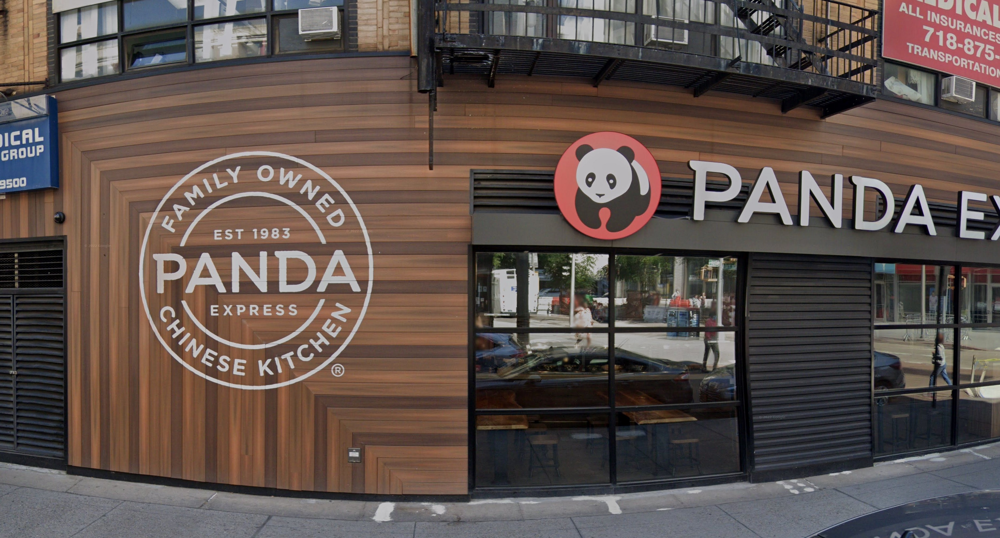
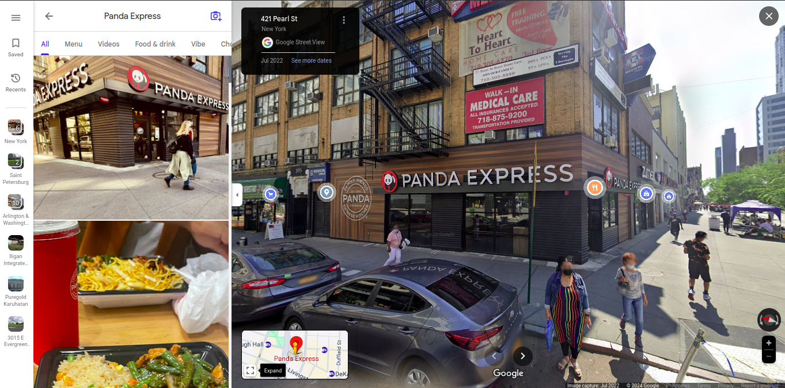
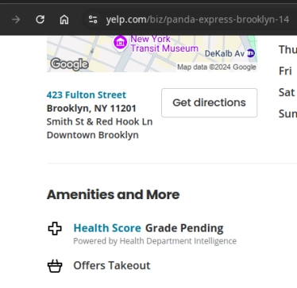

# Challenge

## Description



I visited this gourmet restaurant a while back, but I'm worried about the health and safety rating of it. Could you check it for me? Oh, and before I forget, could you tell me when the building was built, as well as the name of the LLC that owns it? Flag Format: csawctf{HealthGrade_YearBuilt_LLCName} (Name does not include LLC, replace all spaces with _)

## My Solution

Seeing a telephone number on the upper right corner of the image, I immediately searched for '718 area code' and the result was New York City. I opened Google Maps and searched for Panda Express restaurants in New York. I eventually found the one in the photo.



From here on out, I had to find the information I need. I tried to look for the **HealthGrade** first, but couldn't find it! I only found this from Yelp:



I was skeptical so I skipped it and moved on to the **YearBuilt** and **LLCName**. *Spoiler Alert: It was the correct answer*

This took me a while to find, I tried searching for the street name and building (423 Fulton Street Panda Express Building, 421 Pearl St. Building, etc.) trying to look for the name of the building. Then I found this:

```
https://www.propertyshark.com/mason/Property/120903/423-Fulton-St-Brooklyn-NY-11201/
```

The link had all the information I need, the year built and the LLC name of the building!

I now have these information:

1. YearBuilt = **1920**
2. LLCName = **Bnn Fulton Flushing Owner LLC** (You might need to sign in to see this)

For the HealthGrade, I tried different grades such as Good, Healthy, A+ but nothing worked. I then tried **Pending**, et voila, it worked!

## Flag

<details> 
  <summary>Flag</summary>
   csawctf{Pending_1920_Bnn_Fulton_Flushing_Owner}
</details>