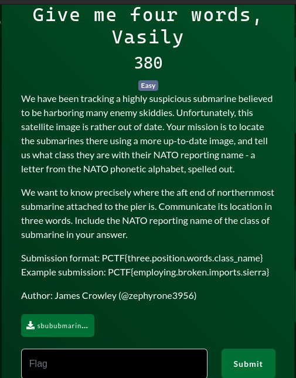
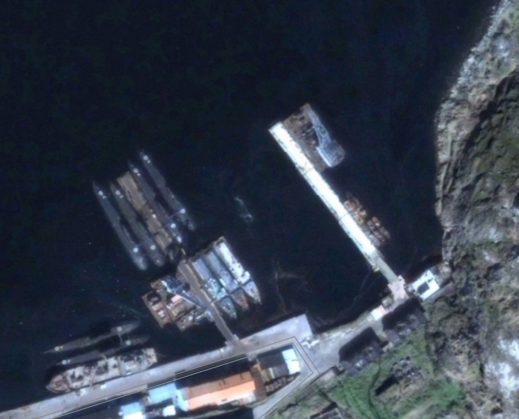
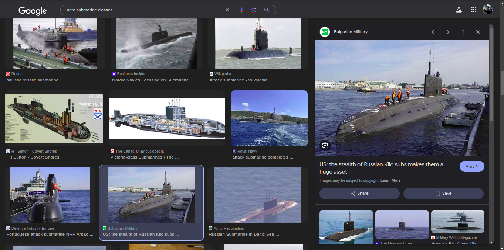
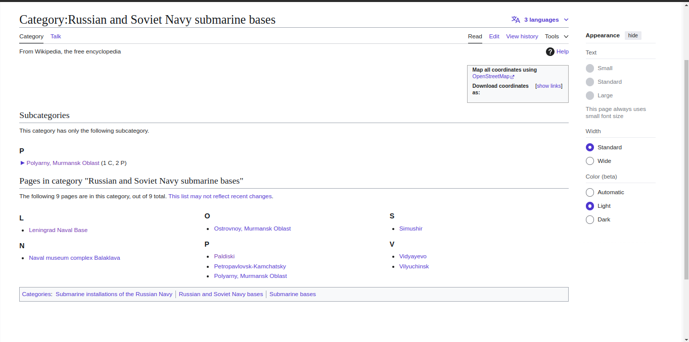
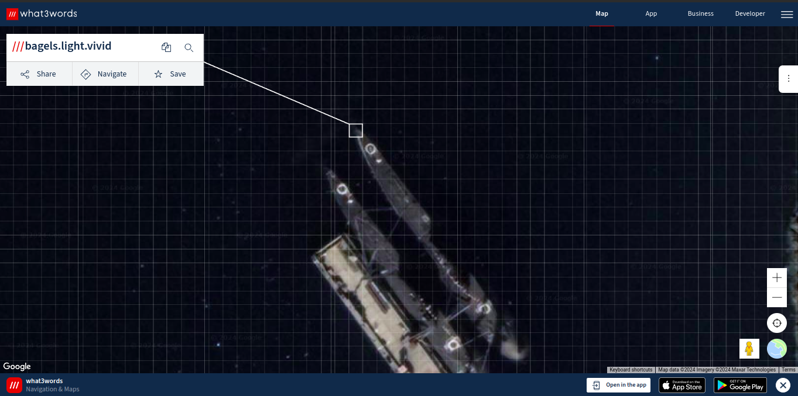

# Challenge

## Description

## Image

## My Solution

Might be Kilo (Project 877) submarine. After looking at pictures of NATO class submarines, I figured the two white circles are unique to this class.

Since it's a Soviet submarine, I searched for 'Russian submarine port' on Google and found a Wikipedia page with list of Russian and Soviet Navy submarine bases.

I searched all the locations via Google Maps and found the location to be Polyarny, Murmansk Oblast.

Used what3words.com to find the 3 word location for the aft end of Northernmost submarine. As said in the description, this is a more up-to-date image of the port.

I now have these information:

1. class_name = kilo
2. three.position.words = bagels.light.vivid

## Flag

 
  
Flag

   PCTF{bagels.light.vivid.kilo}

