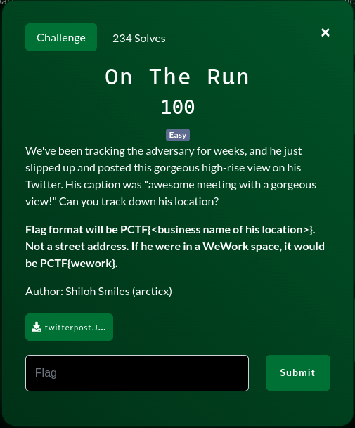
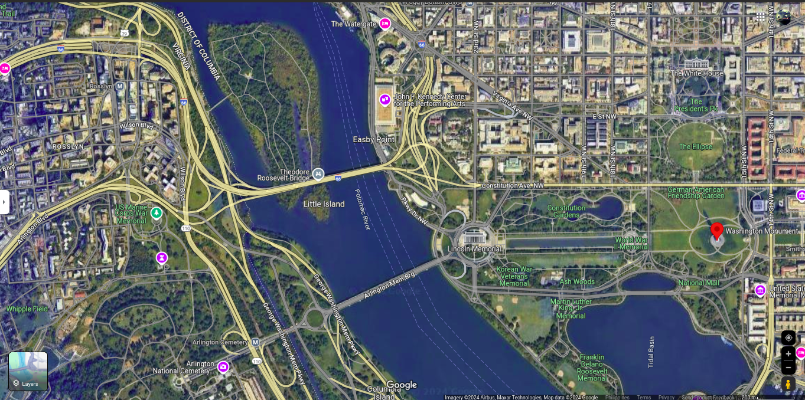
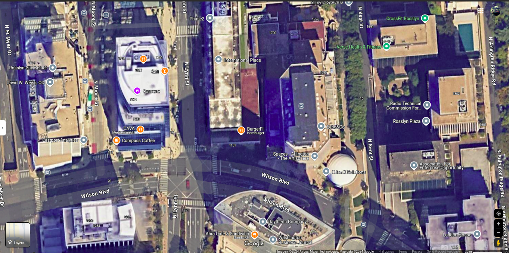

# Challenge

## Description

## Image

## My Solution

First glance at the image we can see the Washington monument. Searched for it in Google maps and the nearby river matches.

I found the building which is CEB building, now I just need to find the business name. Luckily there are only a few locations that popped up in Google maps and I eventually found it.

The following image shows the correlation:

## Flag

 
  
Flag

   PCTF{Convene}

